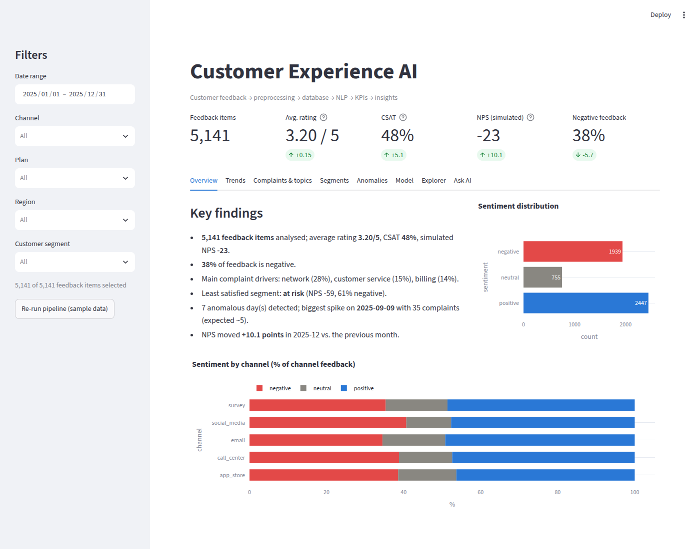
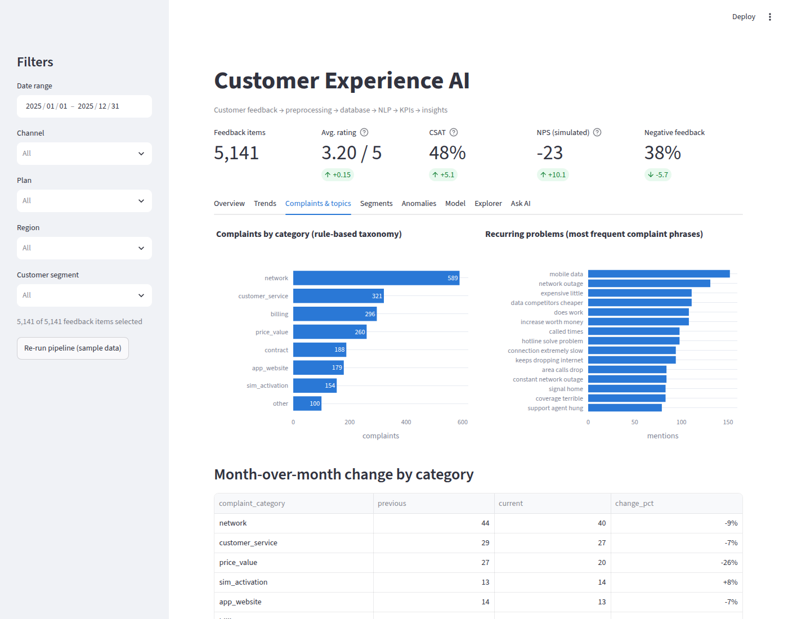
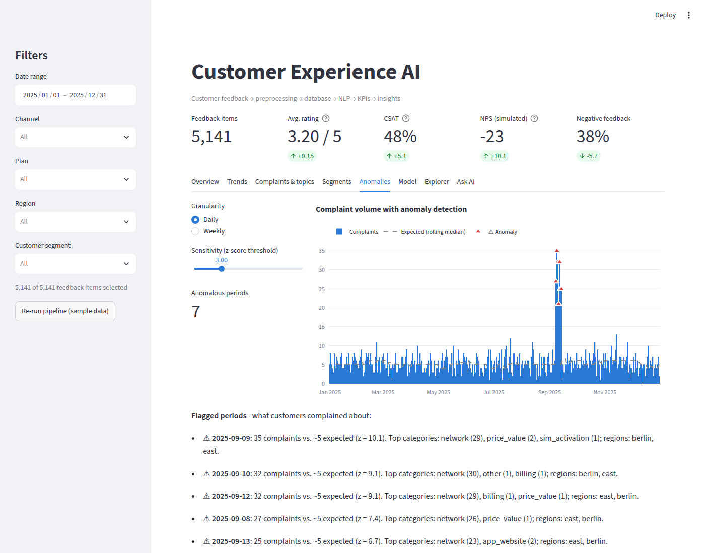

# Customer Experience AI: Feedback Analytics Platform

A complete pipeline that turns raw customer feedback into KPIs, NLP insights and an interactive dashboard.

```
raw feedback → preprocessing → PostgreSQL → sentiment + topics + categories → KPIs → Streamlit dashboard → AI insights
```



## What it does

| Capability | How |
|---|---|
| **Sentiment classification** | TF-IDF + Logistic Regression trained on weak labels from star ratings, evaluated on a hold-out set (accuracy, macro-F1, confusion matrix). Optional pretrained transformer for comparison. |
| **Topic modeling** | NMF on TF-IDF over complaints (optional: BERTopic + sentence-transformers) to find new, recurring problems |
| **Complaint categorisation** | A keyword taxonomy (network, billing, customer service, contract, SIM, app, price) that business teams can read and trust |
| **Recurring problems** | The phrases that come up most often in complaints |
| **Trends** | Monthly NPS, rating, sentiment and complaints per category |
| **Customer segments** | NPS / negative share by segment, plan, region, channel |
| **Simulated NPS & CSAT** | 5★ = promoter, 4★ = passive, 1-3★ = detractor; CSAT = share of 4-5★ |
| **Anomaly detection** | Rolling median + MAD z-score on daily/weekly complaint volume (finds the injected network outage) |
| **Natural-language summary** | Rule-based summary of the key findings (always available) |
| **"Ask AI"** | Questions like *"What were the main reasons for negative feedback this month?"* are answered by Claude, using KPIs and PII-masked example comments as context |
| **Data privacy** | E-mails, phone numbers, URLs and @handles are masked before anything is stored |

## Tech stack

**Core:** Python · Pandas · NumPy · SQL · PostgreSQL (SQLite for zero-setup local runs) · SQLAlchemy
**AI/NLP:** scikit-learn · optional sentence-transformers / BERTopic / Hugging Face transformers · Anthropic Claude API (optional)
**Visualisation:** Streamlit · Plotly
**Engineering:** Git · GitHub Actions (lint, tests on SQLite *and* PostgreSQL, Docker build) · pytest · Ruff · Docker / docker compose

## Quickstart (local, 5 minutes)

```bash
git clone https://github.com/sagharheidari/cufee.git
cd cufee
python -m venv .venv && source .venv/bin/activate    # Windows: .venv\Scripts\activate
pip install -r requirements-dev.txt

python -m src.pipeline            # generate sample data, train models, fill the database
streamlit run dashboard/app.py    # open http://localhost:8501
pytest                            # 30 tests
```

By default everything is stored in a local SQLite file (`data/cx_analytics.db`), so no setup is needed.

## Run with PostgreSQL + Docker

```bash
docker compose up --build         # starts PostgreSQL + runs the pipeline + serves the dashboard
```

Or use PostgreSQL with a local Python environment:

```bash
docker compose up -d db
cp .env.example .env              # then uncomment the DATABASE_URL line
python -m src.pipeline
streamlit run dashboard/app.py
```

## Use a real public dataset

The pipeline maps any CSV / JSON-lines file onto its schema with `--map SOURCE=TARGET`
(required: `created_at`, `text`; recommended: `rating`).

**Amazon Reviews 2023** (has ratings + timestamps; download a category such as *Cell_Phones_and_Accessories* from https://amazon-reviews-2023.github.io):

```bash
python -m src.pipeline --source file --path data/Cell_Phones_and_Accessories.jsonl.gz \
    --map timestamp=created_at --limit 50000
```

**Customer Support on Twitter** (Kaggle: `thoughtvector/customer-support-on-twitter`, which includes telecom brands). It has no ratings, so use the pretrained transformer:

```bash
pip install -r requirements-optional.txt
python -m src.pipeline --source file --path data/twcs.csv --map tweet_id=feedback_id \
    --limit 50000 --sentiment-backend transformer
```

See [`data/README.md`](data/README.md) for details.

## Enable the LLM ("Ask AI")

```bash
cp .env.example .env    # set ANTHROPIC_API_KEY=...
```

Without a key, the tab answers with the rule-based summary, so the app never breaks.
The model only sees aggregated KPIs and a few dozen PII-masked comments, never the full database.

## Project structure

```
├── src/
│   ├── config.py            # settings from env / .env
│   ├── data_generator.py    # synthetic telecom feedback (with an injected outage)
│   ├── ingest.py            # load CSV/JSONL datasets into a canonical schema
│   ├── preprocessing.py     # cleaning, PII masking, dedup, weak labels, NPS groups
│   ├── database.py          # SQLAlchemy engine, schema, named SQL queries
│   ├── sentiment.py         # TF-IDF + LogReg model with evaluation; optional transformer
│   ├── topic_modeling.py    # NMF / BERTopic topics + complaint taxonomy
│   ├── analytics.py         # KPIs, trends, segments, anomalies, summaries
│   ├── insights.py          # LLM question answering (Claude) with rule-based fallback
│   └── pipeline.py          # CLI that runs everything end to end
├── sql/
│   ├── schema.sql           # tables + indexes (PostgreSQL & SQLite compatible)
│   └── analytics_queries.sql
├── dashboard/app.py         # Streamlit app (8 tabs)
├── notebooks/exploratory_analysis.ipynb
├── tests/                   # pytest: unit + end-to-end pipeline tests
├── docs/                    # architecture, data dictionary, step-by-step guide
├── .github/workflows/ci.yml
├── Dockerfile, docker-compose.yml, Makefile
```

## Results on the sample data

* Sentiment model: **89% hold-out accuracy, macro-F1 0.83** (neutral is the hardest class)
* The anomaly detector flags exactly the 7 days of the injected September network outage
* Main complaint drivers: network (28%), customer service (15%), billing (14%)
* `at_risk` customers have an NPS of −59 vs. −3 for loyal customers

| Complaints & recurring problems | Anomaly detection |
|---|---|
|  |  |

> The bundled dataset is **synthetic** and made from templates, so the scores are higher than you would get on real data.
> Report the numbers from a real dataset in your CV.

## Documentation

* [Architecture](docs/architecture.md)
* [Data dictionary](docs/data_dictionary.md)
* [Step-by-step guide](docs/STEP_BY_STEP.md): what to do next, in order
