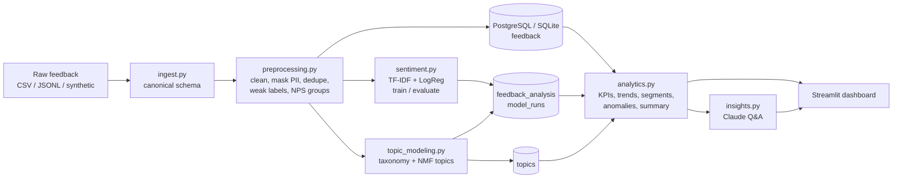

# Architecture

## Design decisions

| Decision | Why |
|---|---|
| **SQLite by default, PostgreSQL in Docker/CI** | Anyone can run it in one command; CI proves it works on PostgreSQL too. The schema avoids dialect-specific types, and date buckets (`feedback_month`, `feedback_week`) are computed in Python so the SQL is portable. |
| **Weak labels from ratings** | Real feedback rarely has sentiment labels. Star ratings are a cheap, noisy label. The model learns the language of the text, so it also works on feedback that has no rating. |
| **TF-IDF + Logistic Regression as baseline** | Fast, explainable (see `SentimentClassifier.top_terms`) and CI-friendly. Transformers are optional and can be compared against it. |
| **Taxonomy and topic model** | Stakeholders need stable, named categories to track KPIs over time (taxonomy). The topic model finds new issues the taxonomy doesn't cover yet. |
| **Topics fitted on complaints only** | Stops positive praise from taking over the vocabulary, so the topics describe what is going wrong. |
| **Robust anomaly detection** | A rolling median + MAD, with a Poisson floor of √expected, so a spike doesn't inflate its own baseline and quiet days don't trigger false alarms. |
| **LLM gets aggregates, not raw data** | Cheap, fast and privacy-friendly, and every number in the answer can be traced back to the context. |
| **Rule-based fallback** | The dashboard works with no API key, in CI and offline. |

## Database schema

* `feedback`: one row per feedback item (PII masked)
* `feedback_analysis`: sentiment, category, complaint flag and topic per feedback item
* `topics`: discovered complaint topics with their top terms
* `model_runs`: evaluation metrics from each pipeline run (model monitoring)

See [`sql/schema.sql`](../sql/schema.sql) and [data_dictionary.md](data_dictionary.md).
